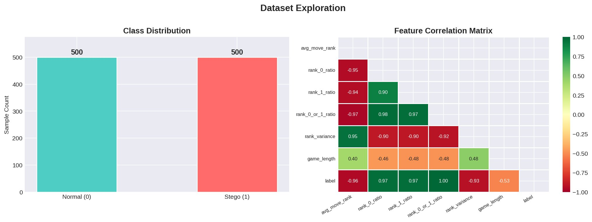
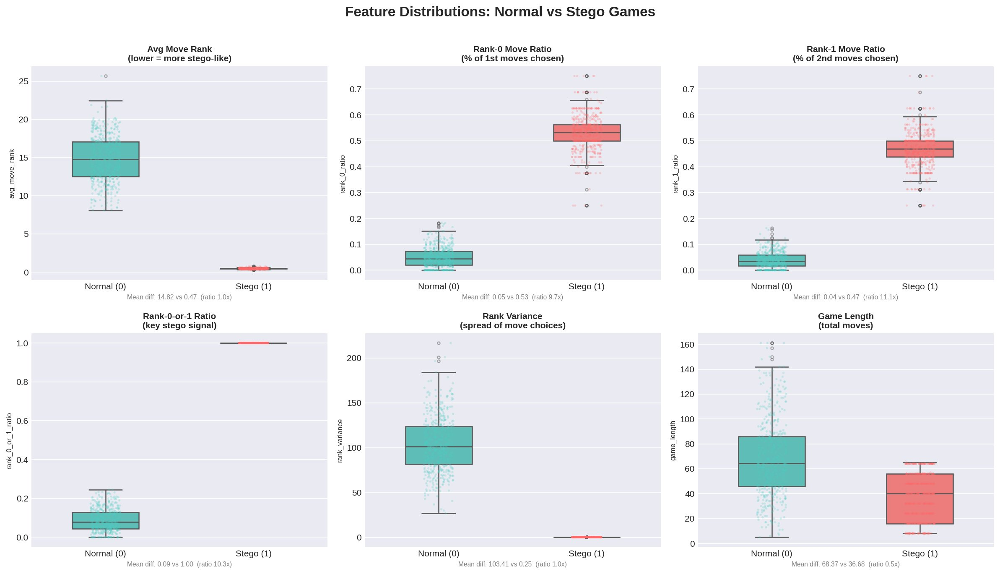
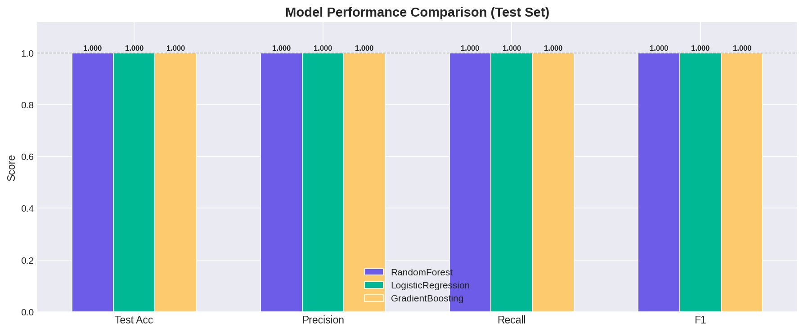
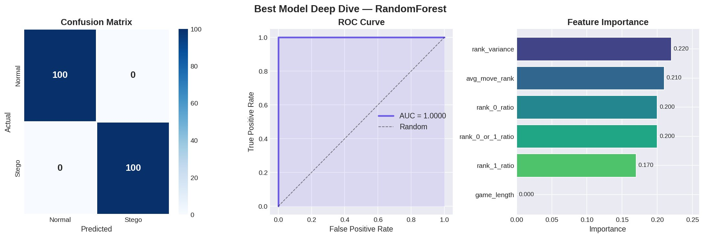

# ♟️ Chess Steganography Detector

> Shaxmat o'yinlari ichiga yashirilgan maxfiy ma'lumotlarni aniqlash uchun Machine Learning tizimi

---

## 📌 Loyiha haqida

Bu loyiha **steganografiya** va **machine learning** ni birlashtiradi:

- Matnli ma'lumotlarni standart shaxmat o'yinlari (PGN format) ichiga **yashirish**
- Yashirilgan ma'lumotlarni **qayta tiklash**
- ML model yordamida o'yinda yashirin ma'lumot **borligini aniqlash**

Loyiha real **Lichess.org** bazasidan olingan 10,000+ o'yin va sintetik steganografik o'yinlar asosida o'qitilgan.

---

## 🧠 Qanday ishlaydi?

### Kodlash prinsipi

Har bir pozitsiyadagi qonuniy yurishlar (`legal_moves`) alifbo tartibida saralanad. Yashiriladigan ma'lumotning har bir biti:

- `bit = 0` → `legal_moves[0]` tanlanadi
- `bit = 1` → `legal_moves[1]` tanlanadi

Natijada oddiy ko'rinishdagi, lekin ichida ma'lumot yashirilgan PGN fayl hosil bo'ladi.

### Aniqlash prinsipi

Steganografik o'yinlarda `rank_0_or_1_ratio` **har doim 1.0** — faqat birinchi yoki ikkinchi yurish tanlanadi. Oddiy inson o'yinlarida bu ko'rsatkich **~0.09**. ML model aynan shu va boshqa statistik farqlarni o'rganadi.

---

## 📊 Dataset va Feature'lar

**Dataset:** 1,000 o'yin (500 normal + 500 steganografik), balanced

**Normal o'yinlar manba'i:** Lichess.org 2018-09 bazasi, 1500–1600 Elo o'yinchilar

| Feature | Normal o'yin | Stego o'yin | Farq |
|---|---|---|---|
| `avg_move_rank` | 14.82 | 0.47 | ~31x |
| `rank_0_or_1_ratio` | 0.089 | 1.000 | **Mutlaq separator** |
| `rank_variance` | 103.4 | 0.25 | ~414x |
| `rank_0_ratio` | 0.050 | 0.530 | ~10x |
| `rank_1_ratio` | 0.039 | 0.470 | ~12x |
| `game_length` | 68.4 | 36.7 | — |

### Dataset taqsimoti va feature korrelyatsiyasi



### Feature taqsimoti: Normal vs Stego



---

## 📈 Model natijalari

Uchta model sinaldi: **RandomForest**, **LogisticRegression**, **GradientBoosting**. Barchasi 5-fold cross-validation va test to'plamida baholandi.

### Model taqqoslash



### Eng yaxshi model: RandomForest — chuqur tahlil



| Metrika | RandomForest | LogisticRegression | GradientBoosting |
|---|---|---|---|
| Test Accuracy | **1.000** | 1.000 | 1.000 |
| Precision | **1.000** | 1.000 | 1.000 |
| Recall | **1.000** | 1.000 | 1.000 |
| F1 Score | **1.000** | 1.000 | 1.000 |
| AUC-ROC | **1.000** | 1.000 | 1.000 |

> **Nima uchun 100%?** Signal juda kuchli — steganografik o'yinlarda `rank_0_or_1_ratio` har doim `1.0`, inson o'yinlarida `~0.09`. Bu deterministik algoritmning tabiiy natijasi.

---

## 📂 Loyiha tuzilishi

```
chess-steganography/
│
├── stego_engine.py        # Asosiy steganografiya mexanizmi
├── encoder.py             # Ma'lumotni PGN ga kodlash
├── decoder.py             # PGN dan ma'lumotni qayta tiklash
├── main.py                # Encode + decode demo
│
├── feature_extractor.py   # O'yindan 6 ta ML feature ajratish
├── data_extractor.py      # Lichess bazasidan o'yinlar filtrlash
├── dataset_builder.py     # Labeled dataset (CSV) yaratish
│
├── train_detector.ipynb   # Google Colab training notebook (T4 GPU)
├── stego_detector.pkl     # O'qitilgan model (joblib bundle)
│
├── dataset.csv            # 1000 namunali training dataset
├── filtered_500_600.pgn   # 10,000 haqiqiy Lichess o'yini
│
└── requirements.txt       # Kutubxonalar
```

---

## 🚀 O'rnatish va ishlatish

### 1. O'rnatish

```bash
git clone https://github.com/al1sher-hp/chess-steganography.git
cd chess-steganography
pip install -r requirements.txt
```

### 2. Ma'lumot yashirish

```python
from encoder import encode_message

encode_message("Maxfiy xabar", output_pgn="secret_game.pgn")
```

### 3. Ma'lumot qayta tiklash

```python
from decoder import decode_pgn

message = decode_pgn("secret_game.pgn", payload_length=96)
print(message)  # "Maxfiy xabar"
```

### 4. Steganografiya aniqlash

```python
import joblib, chess.pgn
from feature_extractor import extract_features

bundle = joblib.load("stego_detector.pkl")
model = bundle["model"]

with open("unknown_game.pgn") as f:
    game = chess.pgn.read_game(f)

features = [extract_features(game)]
prob = model.predict_proba(features)[0][1]

if prob >= 0.5:
    print(f"⚠️  STEGO ANIQLANDI (ishonch: {prob:.1%})")
else:
    print(f"✅  Oddiy o'yin (ishonch: {1-prob:.1%})")
```

---

## 🔬 Model o'qitish (Google Colab)

```
1. dataset.csv va train_detector.ipynb fayllarini Colabga yuklang
2. Runtime → Change runtime type → T4 GPU
3. Barcha celllarni ketma-ket ishga tushiring
4. stego_detector.pkl yuklab oling
```

---

## 🛠️ Texnologiyalar

| Texnologiya | Maqsad |
|---|---|
| Python 3.10+ | Asosiy til |
| `python-chess` | Shaxmat mantiqi va PGN ishlash |
| `scikit-learn` | ML modellar (RF, LR, GB) |
| `pandas` / `numpy` | Ma'lumot tahlili |
| `matplotlib` / `seaborn` | Vizualizatsiya |
| `joblib` | Model saqlash |
| Google Colab T4 | Model o'qitish muhiti |
| Lichess.org | Real o'yin dataset manba'i |

---

## 💡 Metodologiya

Loyiha **AI-Assisted Development** metodologiyasi asosida qurilgan — g'oya, arxitektura va texnik qarorlar muallif tomonidan ishlab chiqilgan, kod yozish jarayoni zamonaviy AI vositalari bilan tezlashtirilgan.

---

## 📄 Litsenziya

MIT License — erkin foydalanish, o'zgartirish va tarqatish mumkin.

---

*Nusratov Alisher — 2026*
